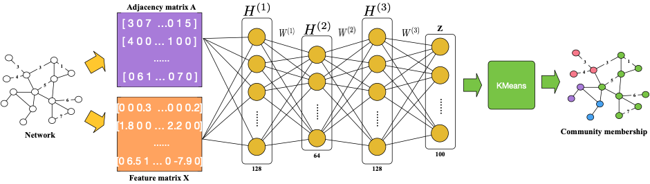

DCD: A Deep Learning-Based Community Detection Software for Large-scale Networks
=========================================================

DCD (Deep learning-based Community Detection) is designed to apply state-of-the-art deep learning technologies to identify communities for large-scale networks. Compared with existing community detection methods, DCD offers a unified solution for many variations of community detection problems.  



DCD provides 4 implementation of community detection, 1 evaluation, and two types of networked data:


| Function      | Description       | Input | Output |
|------------|-------------------------------|-----------|---------|
| KMeans     | Clustering baseline method (1) | Network node file <br/> Network edge file <br/> K | <node id, community id> |
| MM      | Clustering baseline method (2) | Network node file <br/> Network edge file | <node id, community id> |
| DCD     | DCD | Network node file <br/> Network edge file <br/> K | <node id, community id> |
| DCD+    | Variant of GCN with node attributes | Network node file with attributes <br/> Network edge file <br/> K | <node id, community id> |
| Evaluation | Evaluate the performance | Network node file <br/> Network edge file <br/> Community assignment | performance value|
| Random network | Generate random network datasets | Network size <br/> Community size <br/> Probability of edges within communities <br/> Probability of edges between communities <br/> Directed network flag | <node id, community id> <br/> Network node file <br/> Network edge file |
| Facebook network  | Import Facebook brand-brand network  | None| Facebook dataset |
| Citation network  | Import citation network  | None| [Citation] dataset |

[Citation]: https://snap.stanford.edu/data/cit-HepTh.html

Performance
------------

Performance comparison on four random networks. Note: numbers in parentheses are running time (seconds).

| Network size    | Community size  | K-Means | Modularity <br/> Maximization| DCD   |
|-----------------|-----------------|---------|------------------------|---------------|
| 100       | 10  | 0.561<br/>(0.07) | 0.922<br/>(0.01) |0.826<br/>(0.01)|
| 1,000     | 100 | 0.699<br/>(1.04) | 0.807<br/>(1.11) |0.935<br/>(0.11)|
| 10,000    | 100 | 0.726<br/>(199.90) | 0.633<br/>(338.82) |0.845<br/>(62.30)|
| 20,000    | 100 | 0.709<br/>(807.56) | 0.702<br/>(1666.59) |0.814<br/>(444.12)|


Performance comparison on two real-world networks. Note: numbers in parentheses are running time (seconds).

| Network   | Community size  | K-Means | Modularity <br/> Maximization| DCD  | DCD+|
|-----------------|-----------------|---------|------------------------|------|-----|
|       | 50  | 0.451<br/>(82.72) |  /   |0.503<br/>(38.46)| 0.532<br/>(39.01) |
|       | 100 | 0.427<br/>(103.91) |   /  |0.519<br/>(37.86)| 0.520<br/>(38.95) |
| Facebook <br/> weighted and undirected <br/>network with node attributes | 150 | 0.406<br/>(118.58) |   /  |0.532<br/>(37.87)| 0.525<br/>(38.92) |
|       | 200 | 0.383<br/>(144.77) |  /   |0.521<br/>(37.87)| 0.530<br/>(39.50)|
|       | 33(mm)| 0.464<br/>(75.47) |  0.516<br/>(64.70) |0.521<br/>(38.05)| 0.538<br/>(39.20) |
|       |       |   |   |   |   |
|       | 100 | 0.438<br/>(446.27) |  /   |0.897<br/>(216.36)||
|       | 200 | 0.447<br/>(596.94) |   /  |0.916<br/>(216.37)||
| Facebook <br/> weighted and undirected <br/>network with node attributes | 500 | 0.561<br/>(1096.14) |   /  |0.927<br/>(216.59)| No node attributes |
|       | 1,000 | 0.611<br/>(1843.03) |  /   |0.940<br/>(217.32)| |
|       | 2,078 (mm)  | 0.660<br/>(3219.14) |  0.790<br/>(715.26) |0.939<br/>(217.56)| |


Requirements
------------

Generally, the library is compatible with Python 3.6/3.7.


Installation
------------

### From Conda ###

```bash
conda install -c dcd
```

### From PIP ###

```bash
pip3 install dcd
```

### From Source ###

Before installation, make sure you have `conda` installed.

```bash
git clone https://github.com/kpzhang/deepcommunitydetection
cd deepcommunitydetection
conda install -y --file conda/requirements.txt
mkdir build
cd build && cmake .. && make && cd -
cd python && python setup.py install && cd -
```

Quick Start
-----------

Here is a quick-start example.

```bash
KMeans: python kmeans.py --nodes <node file> --edges <edge file> --k <number of communities> --eval <Y/N>
Modularity Maximization: python modularity_maximization.py --nodes <node file> --edges <edge file> --eval <Y/N>
DCD: python dcd.py --nodes <node file> --edges <edge file> --nodeattr <Y/N> --hidden1 <number of neurons in the first hidden layer> --hidden2 <number of neurons in the second hidden layer> --hidden3 <number of neurons in the third hidden layer> --nlabels <number of communities> --eval <Y/N>
```

Input Examples
------------------

node file without attributes:

```bash
node_id_1
node_id_2
node_id_3
...
node_id_n
```

node file with attributes:

```bash
node_id_1 <tab> value_for_attribute_1 value_for_attribute_2 ... value_for_attribute_m
node_id_2 <tab> value_for_attribute_1 value_for_attribute_2 ... value_for_attribute_m
node_id_3 <tab> value_for_attribute_1 value_for_attribute_2 ... value_for_attribute_m
...
node_id_n <tab> value_for_attribute_1 value_for_attribute_2 ... value_for_attribute_m
```

edge file:

```bash
node_id_1 node_id_2
...
node_id_i node_id_j
...
node_id_m node_id_k
```

Development Team
----------------

DCD is developed by Prof.[Kunpeng Zhang], Prof. [Shaokun Fan], and Prof. [Bruce Golden].

[Kunpeng Zhang]: http://www.terpconnect.umd.edu/~kpzhang/
[Shaokun Fan]: https://business.oregonstate.edu/users/shaokun-fan
[Bruce Golden]: http://scholar.rhsmith.umd.edu/bgolden/home

Citation
--------

If you find this useful for your research or development, please cite our work.
